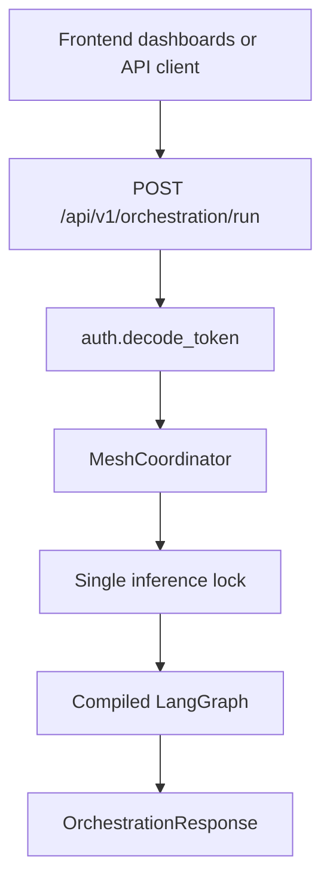
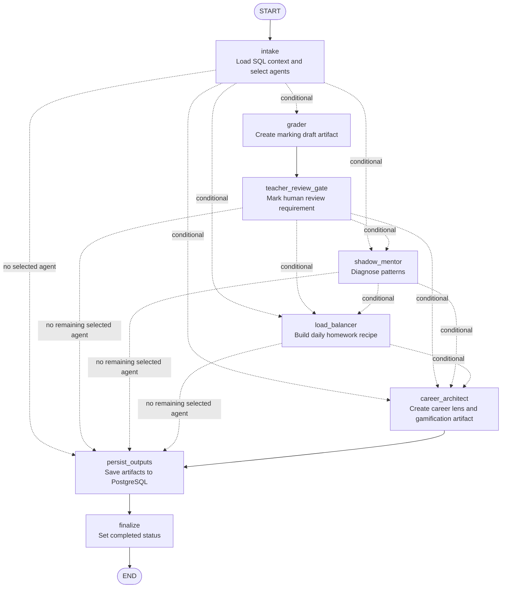
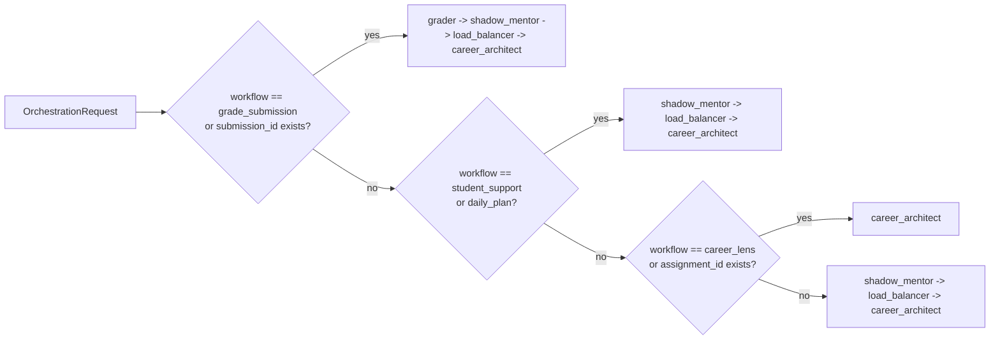
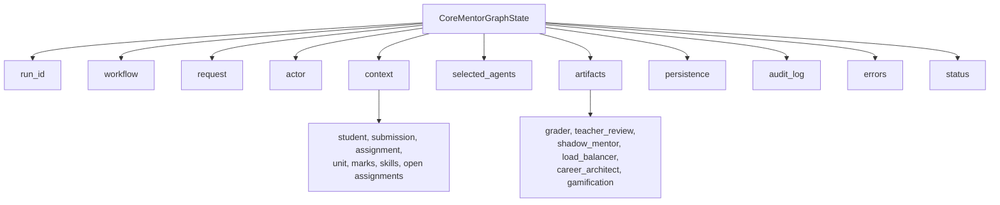
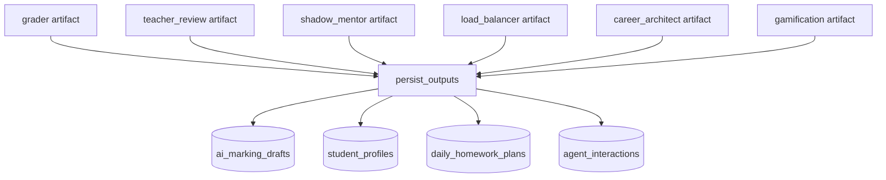
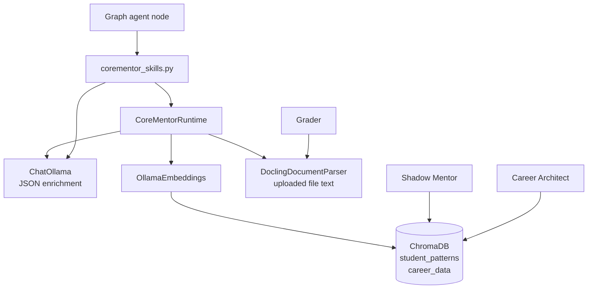
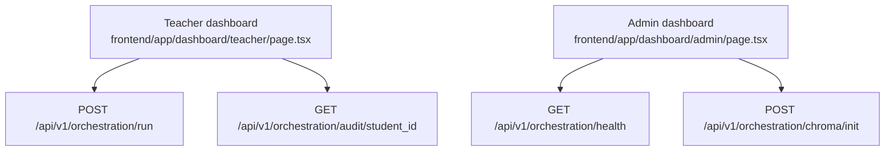

# CoreMentor LangGraph Visualization

Date reviewed: 2026-05-14

This file visualizes the current LangGraph system implemented in:

```text
backend/agents/graph.py
backend/agents/coordinator.py
backend/routers/orchestration_router.py
```

## 1. Main Runtime Entry



## 2. Current LangGraph Node Flow

This is the graph shape currently built by `build_corementor_graph()`.



## 3. Workflow Selection Logic

The graph does not always run every agent. The `intake` node calls `_select_agents()` and then each conditional route chooses the next selected agent in order.



## 4. State Object Moving Through The Graph

Every node receives and returns a shared `CoreMentorGraphState`.



## 5. Agent Outputs And Persistence



Persistence rules are in:

```text
backend/agents/repository.py
persist_graph_outputs()
```

## 6. RAG And Runtime Adapters Around The Graph

The graph nodes call functions in `backend/agents/corementor_skills.py`. Those functions optionally use `CoreMentorRuntime`.



Practical meaning:

- Grader can parse uploaded files through Docling, then ask Ollama to refine the draft.
- Shadow Mentor searches and writes `student_patterns` in ChromaDB.
- Career Architect searches `career_data` in ChromaDB.
- All agent artifacts can be refined by Ollama if `COREMENTOR_LLM_ENABLED=true`.

## 7. UI Views That Expose The Graph



Teacher UI:

```text
/dashboard/teacher -> Agent Orchestration tab
```

Admin UI:

```text
/dashboard/admin -> Agent Health tab
```

## 8. Simplified Mental Model

```text
Request comes in
  -> intake loads context and chooses selected_agents
  -> selected agents run in fixed order
  -> each agent writes an artifact into state.artifacts
  -> persist_outputs saves selected artifacts to database
  -> finalize returns completed response
```

The graph shape is fixed, but the route through it changes depending on the workflow and request IDs.
