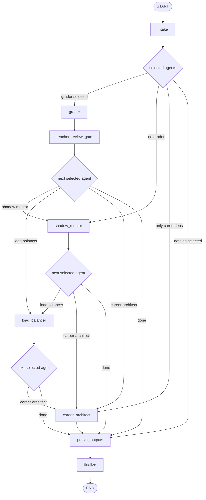
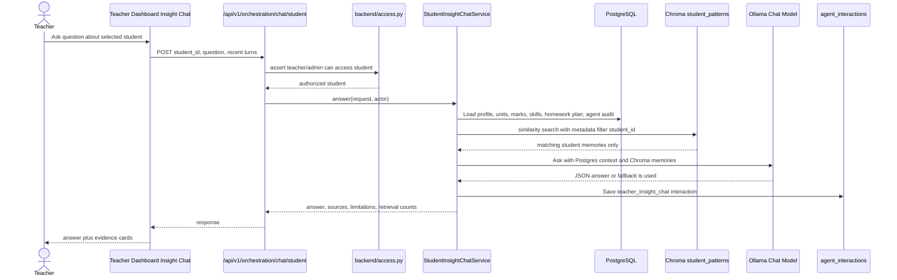
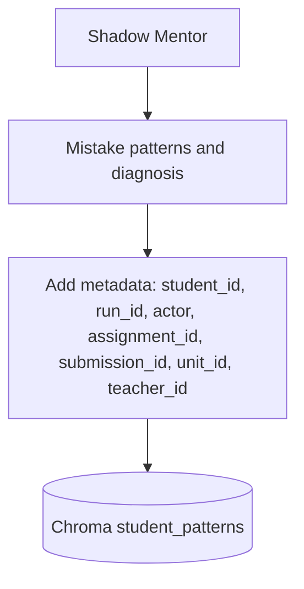
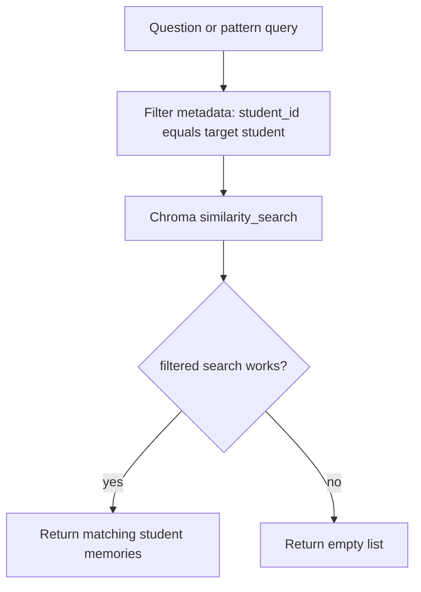
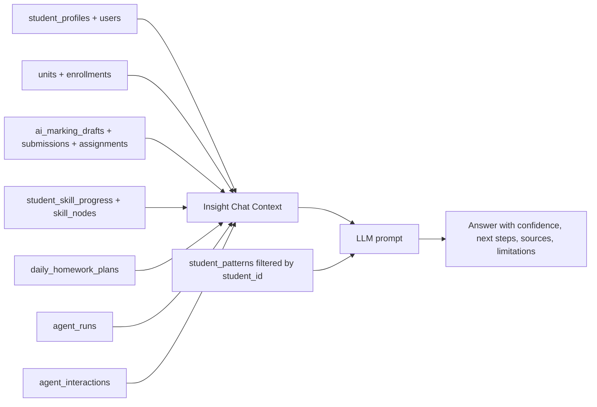
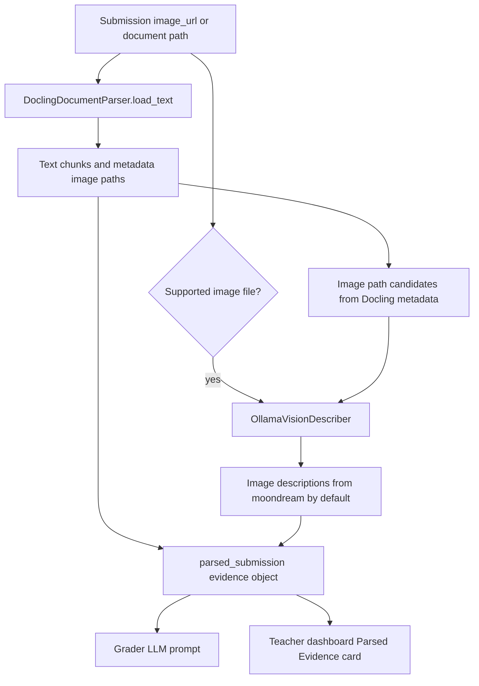
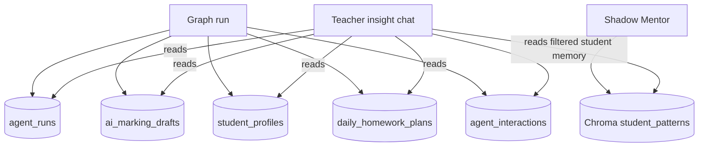
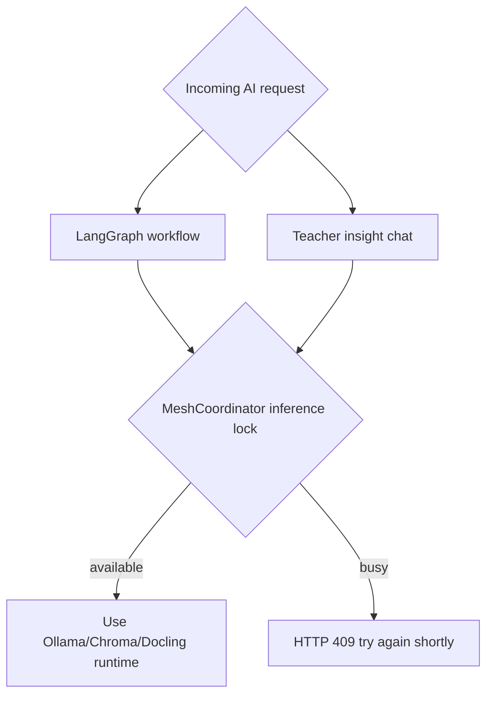
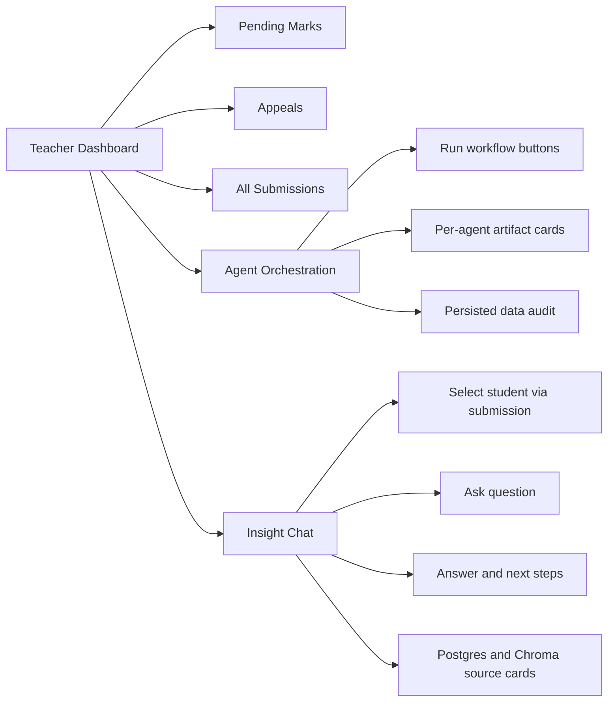

# CoreMentor Latest AI Orchestration Changes

Date reviewed: 2026-05-14

This document describes the current AI orchestration state after the latest access-control, audit, RAG, and teacher insight chat changes.

## 1. Latest Changes At A Glance

| Area | Current state |
| --- | --- |
| LangGraph orchestration | Main graph remains intact: intake, grader, teacher review gate, shadow mentor, load balancer, career architect, persistence, finalize. |
| Teacher/admin access | Student, unit, assignment, submission, marking draft, appeal, and workflow access now pass through shared helpers in `backend/access.py`. |
| Agent run audit | New `agent_runs` table tracks workflow, actor, student, submission, assignment, selected agents, status, and timing. |
| RAG memory isolation | Chroma student-pattern search is filtered by `student_id`; student memory search now returns no results if filtered retrieval fails. |
| Teacher insight chat | New sidecar endpoint lets teachers/admins ask questions about one student using Postgres context plus Chroma student memory. |
| Teacher UI | Teacher dashboard now has `Agent Orchestration` and `Insight Chat` surfaces. |
| Persistence | AI outputs still persist to the existing product tables, with added run-level tracking. |

## 2. Current Topology

```mermaid
flowchart LR
    Teacher[Teacher Dashboard] --> API[FastAPI /api/v1]
    Admin[Admin Dashboard] --> API

    API --> Auth[auth.decode_token and role checks]
    Auth --> Access[backend/access.py scoped access policy]

    Access --> Orchestration[POST /orchestration/run]
    Access --> Chat[POST /orchestration/chat/student]
    Access --> Audit[GET /orchestration/audit/{student_id}]
    Access --> Insights[GET /insights/students/{student_id}/learning-profile]

    Orchestration --> Mesh[MeshCoordinator]
    Mesh --> Graph[LangGraph CoreMentor graph]
    Graph --> Skills[corementor_skills.py]

    Chat --> InsightChat[StudentInsightChatService]

    Skills --> Runtime[CoreMentorRuntime]
    InsightChat --> Runtime

    Runtime --> Ollama[Ollama ChatOllama<br/>gemma4:4b by default]
    Runtime --> Embeddings[OllamaEmbeddings<br/>nomic-embed-text by default]
    Runtime --> Vision[Ollama vision<br/>moondream by default]
    Runtime --> Chroma[ChromaDB<br/>backend/storage/chroma]
    Runtime --> Docling[Docling document parser]

    Graph --> Postgres[(PostgreSQL)]
    InsightChat --> Postgres
    InsightChat --> Chroma
    Skills --> Chroma
    Skills --> Vision
```

## 3. Main LangGraph Workflow

The main graph is still the authoritative agent pipeline. The new teacher insight chat does not insert itself into this graph. It is a sidecar that shares runtime, access policy, audit logging, and the local inference lock.



## 4. Workflow Selection Rules

Configured in `backend/agents/graph.py`, `_select_agents()`.

| Request | Selected agents |
| --- | --- |
| `workflow="grade_submission"` | `grader`, `shadow_mentor`, `load_balancer`, `career_architect` |
| `workflow="student_support"` | `shadow_mentor`, `load_balancer`, `career_architect` |
| `workflow="daily_plan"` | `shadow_mentor`, `load_balancer`, `career_architect` |
| `workflow="career_lens"` | `career_architect` |
| `workflow="auto"` with `submission_id` | `grader`, `shadow_mentor`, `load_balancer`, `career_architect` |
| `workflow="auto"` with `assignment_id` only | `career_architect` |
| `workflow="auto"` default | `shadow_mentor`, `load_balancer`, `career_architect` |

## 5. Teacher Insight Chat Sidecar

New endpoint:

```text
POST /api/v1/orchestration/chat/student
```

Request schema:

```json
{
  "student_id": "student-profile-uuid",
  "question": "What is this student struggling with most?",
  "conversation": [
    { "role": "teacher", "content": "Previous teacher question" },
    { "role": "assistant", "content": "Previous AI answer" }
  ]
}
```

Response shape:

```json
{
  "student_id": "student-profile-uuid",
  "answer": "Evidence-grounded answer",
  "confidence": "low | medium | high",
  "recommended_next_steps": [],
  "source_ids_used": [],
  "sources": [],
  "limitations": [],
  "retrieval": {
    "postgres_source_count": 6,
    "chroma_memory_count": 0,
    "chroma_student_filter": "student-profile-uuid"
  }
}
```

### Insight Chat Retrieval Flow



## 6. RAG And Chroma State

Current Chroma collections:

| Collection | Purpose | Isolation method |
| --- | --- | --- |
| `student_patterns` | Student mistake patterns and long-term learning memory | Shared collection, filtered by `student_id` metadata |
| `career_data` | Career examples for Career Architect | Shared collection, filtered by `career_goal` metadata |

Student memory writes:



Student memory reads:



Important current behavior:

- Student-pattern retrieval no longer falls back to unfiltered Chroma search.
- If Chroma filtering fails, the student RAG memory result is empty.
- Career retrieval can still use unfiltered fallback because career examples are not student-private.

## 7. Postgres Retrieval Used By Insight Chat

The teacher insight chat builds a scoped Postgres context before asking the LLM.



Teacher scope is applied before context is built:

- Admin can see all students.
- Teacher can see only students enrolled in units they teach.
- Teacher-visible marks and skills are limited to the teacher's visible units.
- Student and parent roles do not have access to the teacher insight chat endpoint.

## 7A. Docling And Image Description In The Grader

The Grader now separates text evidence from image evidence.



Current behavior:

- Docling still parses uploaded files into text.
- Direct image submissions such as JPG, PNG, WEBP, BMP, and GIF are sent to the configured Ollama vision model.
- If Docling exposes image paths in document metadata, those image paths are also sent to the vision model.
- The default vision model is `moondream`, chosen because Ollama lists it as a small text+image model designed for efficient local/edge use.
- If vision is disabled, Ollama is unavailable, the image is too large, or no image candidate is found, grading still continues with text and deterministic fallback evidence.

## 8. Persistence And Audit Tables



| Table/model | Current use |
| --- | --- |
| `AgentRun` / `agent_runs` | One run-level record per orchestration workflow. |
| `AgentInteraction` / `agent_interactions` | Per-agent audit log plus teacher insight chat Q&A records. |
| `AIMarkingDraft` / `ai_marking_drafts` | AI grader draft, confidence, feedback, pending status. |
| `StudentProfile` / `student_profiles` | Shadow Mentor diagnosis and teacher notes. |
| `DailyHomeworkPlan` / `daily_homework_plans` | Load Balancer homework plan artifact. |
| Chroma `student_patterns` | Semantic student pattern memory, filtered by `student_id`. |
| Chroma `career_data` | Career examples for career lens generation. |

## 9. API Surface

| Endpoint | Role | Purpose |
| --- | --- | --- |
| `POST /api/v1/orchestration/run` | Authenticated, role-scoped | Run the LangGraph mesh workflow. |
| `GET /api/v1/orchestration/health` | Teacher/Admin | Show graph shape, runtime config, adapter status. |
| `POST /api/v1/orchestration/chroma/init` | Teacher/Admin | Create Chroma collections. |
| `GET /api/v1/orchestration/audit/{student_id}` | Teacher/Admin, student-scoped | Read recent persisted AI outputs and run logs. |
| `POST /api/v1/orchestration/chat/student` | Teacher/Admin, student-scoped | Ask RAG questions about one student. |
| `GET /api/v1/insights/students/{student_id}/learning-profile` | Authenticated, student-scoped | Read a scoped learning profile view. |

## 10. Local Inference Lock

The Mesh Coordinator exposes a single local inference slot. Both the main graph and the teacher insight chat use it.



This avoids overlapping local Ollama workloads on machines with limited resources.

## 11. Runtime Configuration

Configured in `.env`, `.env.example`, and `backend/agents/config.py`.

| Env var | Meaning | Current default |
| --- | --- | --- |
| `COREMENTOR_AGENT_MODE` | Mode label returned in health | `hybrid` |
| `COREMENTOR_LLM_ENABLED` | Enables Ollama chat model | `true` |
| `COREMENTOR_CHROMA_ENABLED` | Enables Chroma and embeddings | `true` |
| `COREMENTOR_DOCLING_ENABLED` | Enables Docling file parsing | `true` |
| `COREMENTOR_VISION_ENABLED` | Enables Ollama image description | `true` |
| `OLLAMA_BASE_URL` | Ollama server URL | `http://localhost:11434` |
| `COREMENTOR_OLLAMA_MODEL` | Chat model | `gemma4:4b` |
| `COREMENTOR_OLLAMA_EMBED_MODEL` | Embedding model | `nomic-embed-text` |
| `COREMENTOR_OLLAMA_VISION_MODEL` | Vision/image-description model | `moondream` |
| `COREMENTOR_OLLAMA_TEMPERATURE` | Chat temperature | `0.2` |
| `COREMENTOR_OLLAMA_NUM_CTX` | Context window | `4096` |
| `COREMENTOR_OLLAMA_KEEP_ALIVE` | Ollama keep alive | `10m` |
| `COREMENTOR_VISION_MAX_IMAGES` | Maximum image candidates per submission | `3` |
| `COREMENTOR_VISION_MAX_IMAGE_BYTES` | Per-image byte limit | `6000000` |
| `CHROMA_PERSIST_DIR` | Chroma persistence path | `backend/storage/chroma` |
| `CHROMA_STUDENT_PATTERNS_COLLECTION` | Student memory collection | `student_patterns` |
| `CHROMA_CAREER_DATA_COLLECTION` | Career memory collection | `career_data` |
| `COREMENTOR_UPLOADS_DIR` | Upload path for Docling | `backend/uploads` |

## 12. Current Teacher UI Surfaces



## 13. What Is Fully Connected Now

1. Teachers can run the main graph from real submissions.
2. The graph can persist run outputs and run-level audit records.
3. Shadow Mentor can save student pattern memories to Chroma.
4. Teacher insight chat can retrieve:
   - scoped Postgres facts,
   - scoped Chroma student-pattern memories,
   - local Ollama answers,
   - deterministic fallback answers if the LLM is unavailable.
5. Teacher insight chat records Q&A into `agent_interactions`.
6. Admin and teacher health/audit endpoints expose runtime and persistence state.

## 14. Remaining Operational Notes

- Restart the backend with PostgreSQL running so `Base.metadata.create_all()` can create the new `agent_runs` table.
- Initialize Chroma before expecting RAG memory:

```bash
python backend/scripts/init_chroma.py
```

or call:

```text
POST /api/v1/orchestration/chroma/init
```

- Make sure Ollama has the configured models:

```bash
ollama list
```

Expected model roles:

| Model | Role |
| --- | --- |
| `gemma4:4b` | Chat/reasoning model |
| `nomic-embed-text` | Embedding model for Chroma |
| `moondream` | Lightweight image-description model |

## 15. Verification Already Performed

The latest implementation passed:

```text
backend py_compile
backend import smoke test for student insight chat and orchestration router
frontend npm run lint
frontend npx tsc --noEmit
```

Live end-to-end chat still requires:

- PostgreSQL running,
- backend server running,
- frontend server running,
- Ollama running,
- Chroma initialized,
- at least one accessible student with data or generated student-pattern memory.
